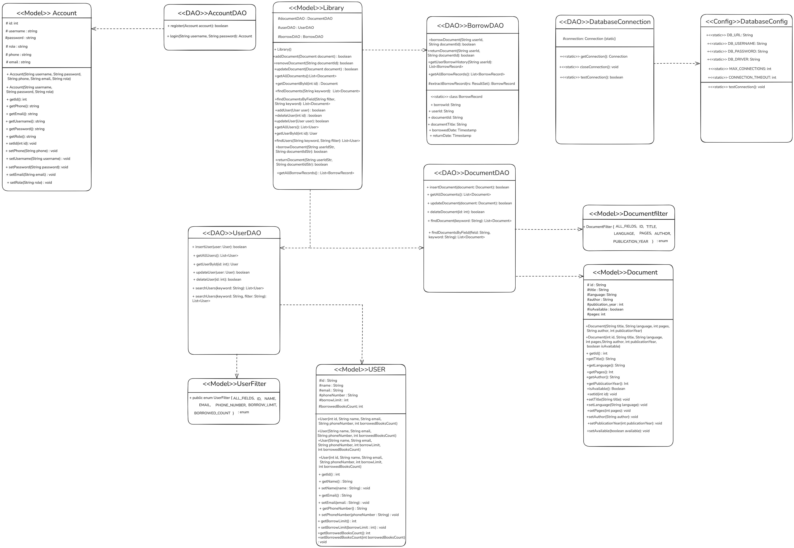

# 📚 Java Library Management System

Hệ thống quản lý thư viện được phát triển bằng Java Swing với giao diện người dùng thân thiện và tích hợp cơ sở dữ liệu MySQL.



## ✨ Tính năng chính

### 🔐 Xác thực người dùng
- Đăng nhập với username/password
- Xác thực qua cơ sở dữ liệu
- Phân quyền theo vai trò (role-based)

### 📖 Quản lý tài liệu
- ➕ Thêm tài liệu mới
- ✏️ Cập nhật thông tin tài liệu
- 🗑️ Xóa tài liệu
- 🔍 Tìm kiếm và lọc theo nhiều tiêu chí
- 🎯 Highlight từ khóa trong kết quả tìm kiếm
- 📊 Hiển thị trạng thái có sẵn/đã mượn

### 👥 Quản lý người dùng  
- 👤 Thêm người dùng mới
- ✏️ Cập nhật thông tin cá nhân
- 🗑️ Xóa người dùng
- 🔍 Tìm kiếm người dùng
- 📊 Theo dõi số sách đã mượn/giới hạn

### 📋 Quản lý mượn/trả
- 📤 Xử lý mượn sách
- 📥 Xử lý trả sách  
- 📅 Theo dõi lịch sử mượn/trả
- 🔍 Tìm kiếm lịch sử theo nhiều tiêu chí
- ⏰ Hiển thị ngày mượn/trả

## 🛠️ Công nghệ sử dụng

- **Ngôn ngữ**: Java 8+
- **GUI Framework**: Java Swing
- **Cơ sở dữ liệu**: MySQL 8.0
- **JDBC Driver**: mysql-connector-java-8.0.33
- **Architecture**: MVC Pattern với DAO Pattern

## 📁 Cấu trúc dự án

```
java_library_management/
├── src/
│   ├── gui/                    # Giao diện người dùng
│   │   ├── LibraryAppGUI.java  # Main launcher
│   │   ├── LoginFrame.java     # Màn hình đăng nhập
│   │   ├── MainFrame.java      # Giao diện chính
│   │   ├── DocumentPanel.java  # Quản lý tài liệu
│   │   ├── UserPanel.java      # Quản lý người dùng
│   │   └── BorrowPanel.java    # Quản lý mượn/trả
│   ├── model/                  # Các lớp entity
│   │   ├── Library.java        # Business logic chính
│   │   ├── Document.java       # Entity tài liệu
│   │   ├── User.java          # Entity người dùng
│   │   └── Account.java       # Entity tài khoản
│   ├── dao/                    # Data Access Objects
│   │   ├── DocumentDAO.java    # CRUD operations cho Document
│   │   ├── UserDAO.java       # CRUD operations cho User
│   │   ├── AccountDAO.java    # CRUD operations cho Account
│   │   └── BorrowDAO.java     # CRUD operations cho Borrow
│   └── config/
│       └── DatabaseConnection.java # Kết nối cơ sở dữ liệu
├── lib/
│   └── mysql-connector-java-8.0.33.jar
├── run_gui.bat                 # Script chạy ứng dụng
└── README.md
```

## 🗄️ Cơ sở dữ liệu

### Các bảng chính:
- `accounts` - Tài khoản đăng nhập
- `users` - Thông tin người dùng
- `documents` - Thông tin tài liệu
- `borrow_records` - Lịch sử mượn/trả

### ERD Schema:
```sql
accounts (id, username, password, phone, email, role)
users (id, name, email, phoneNumber, borrowLimit, borrowedBooksCount)
documents (id, title, language, pages, author, publication_year, is_available)
borrow_records (id, user_id, document_id, borrow_date, return_date, status)
```

## 🚀 Hướng dẫn cài đặt

### 1. **Yêu cầu hệ thống**
- Java JDK 8 trở lên
- MySQL Server 8.0+
- Windows/Linux/macOS

### 2. **Cài đặt cơ sở dữ liệu**
```sql
-- Tạo database
CREATE DATABASE library_management;
USE library_management;

-- Tạo các bảng (xem file database_schema.sql)
```

### 3. **Cấu hình kết nối**
Chỉnh sửa file `src/config/DatabaseConnection.java`:
```java
private static final String URL = "jdbc:mysql://localhost:3306/library_management";
private static final String USERNAME = "your_username";
private static final String PASSWORD = "your_password";
```

### 4. **Biên dịch và chạy**

#### Sử dụng script có sẵn (Windows):
```bash
./run_gui.bat
```

#### Hoặc biên dịch thủ công:
```bash
# Di chuyển vào thư mục src
cd src

# Biên dịch
javac -encoding UTF-8 -cp ".;../lib/*" gui/*.java model/*.java dao/*.java config/*.java

# Chạy ứng dụng
java -cp ".;../lib/*" gui.LibraryAppGUI
```

### 5. **Đăng nhập**
- Username: `admin`
- Password: `admin123`

## 🎨 Giao diện

### Màn hình đăng nhập
- Form đăng nhập với validation
- Xác thực qua database
- Chuyển hướng đến giao diện chính

### Giao diện chính (Tabbed Interface)
- **Documents Tab**: Quản lý tài liệu
- **Users Tab**: Quản lý người dùng  
- **Borrow/Return Tab**: Xử lý mượn/trả

### Tính năng UI nổi bật
- 🎯 Highlight từ khóa tìm kiếm
- 🌈 Màu xen kẽ cho bảng dữ liệu
- 🔘 Nút bo góc đẹp mắt
- ✅ Checkbox cho trạng thái boolean
- 📱 Responsive layout

## 🔍 Tính năng tìm kiếm

### Tìm kiếm thông minh:
- Hỗ trợ tìm kiếm không dấu (VD: "sach" tìm thấy "sách")
- Tìm kiếm theo nhiều trường
- Highlight kết quả tìm kiếm
- Filter theo từng cột cụ thể

### Các bộ lọc:
- **Documents**: All Fields, Title, Author, Language
- **Users**: All Fields, Name, Email, Phone
- **Borrow Records**: All Fields, User ID, Document ID, Document Title

## 🤝 Đóng góp

1. Fork dự án
2. Tạo feature branch (`git checkout -b feature/AmazingFeature`)
3. Commit thay đổi (`git commit -m 'Add some AmazingFeature'`)
4. Push lên branch (`git push origin feature/AmazingFeature`)
5. Mở Pull Request

## 📝 License

Dự án này được phân phối dưới MIT License. Xem file `LICENSE` để biết thêm chi tiết.

## 👤 Tác giả

- **GitHub**: [@yourusername](https://github.com/yourusername)
- **Email**: your.email@example.com

## 🙏 Cảm ơn

- Java Swing Community
- MySQL Documentation
- Stack Overflow Community

---

⭐ **Nếu dự án này hữu ích, hãy cho một star!** ⭐